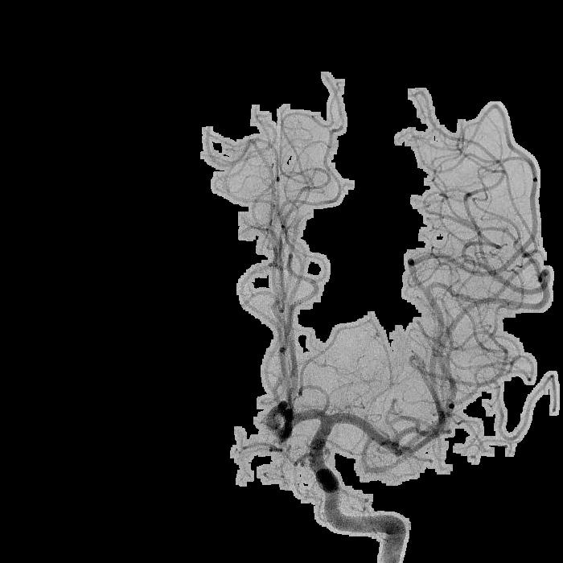
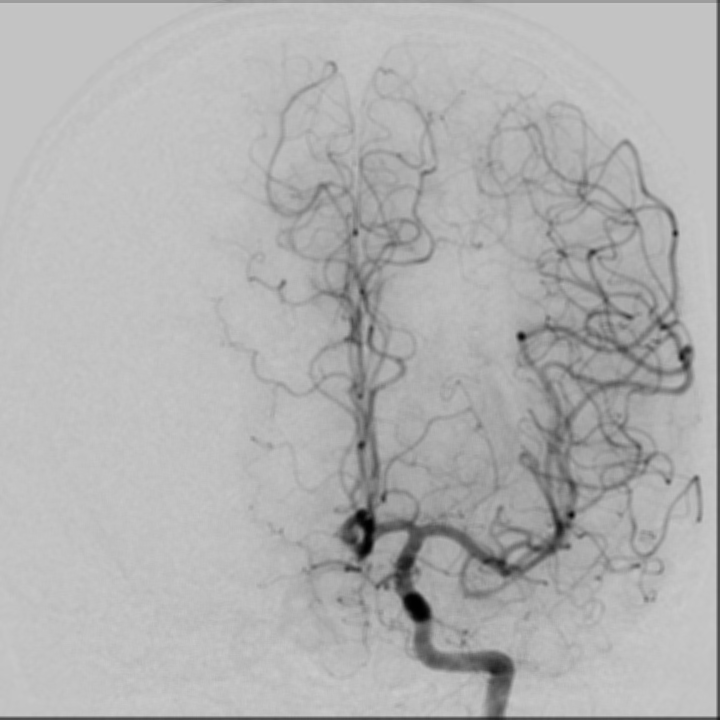
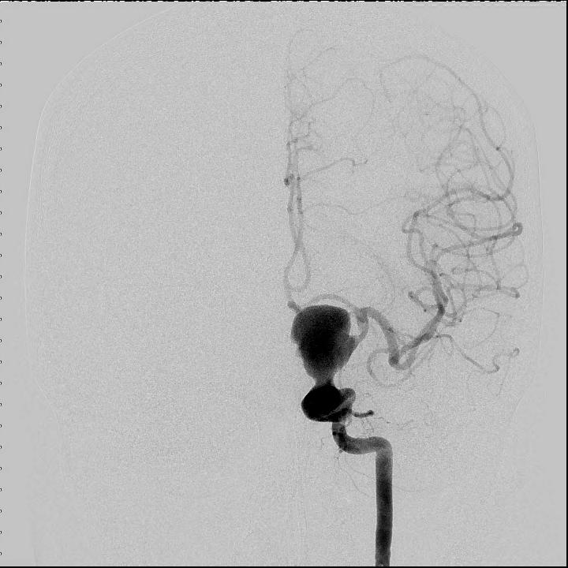
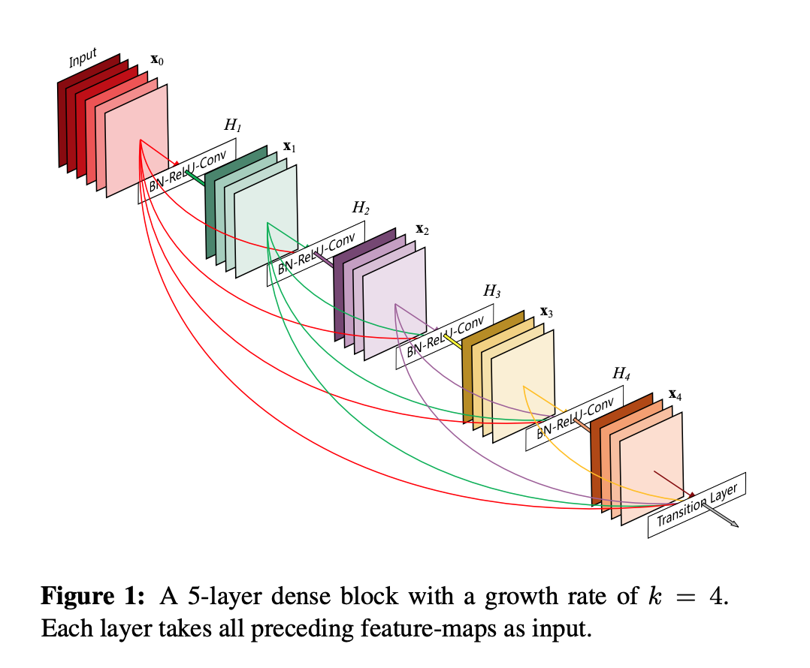
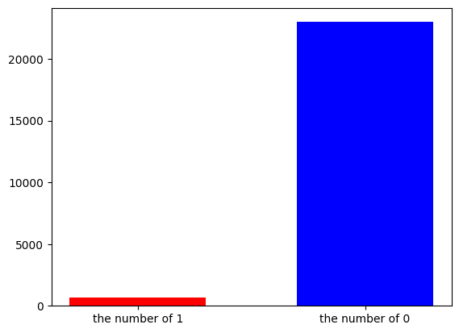

# k-ium 의료 인공지능 경진대회

---

## 개발 환경

> ### CPU
> - Intel(R) Core(TM) i7-10700F CPU @ 2.90GHz   2.90 GHz
> - 64비트 운영 체제, x64 기반 프로세서
> ### OS
> - Window11 Home
> ### GPU
> - NVIDIA GeForce RTX 3060
> ---
> - pyenv-win version 3.1.1
> - python 3.9.13
> - 자세한 라이브러리는 Pipfile, Pipfile.lock을 통해 확인 가능
> - CUDA version 11.7
> - CuDnn : 추후 확인 필요

## 개요
 저희는 부산대학교 인공지능 동아리에서 참여한 AID팀입니다. 두개내 동맥류는 다양한 질병을 유발할 수 있는 뇌혈관 장애입니다. 임상적으로 두개내 동맥류의 진단은 digital subtraction angiography(뇌혈관 조영술) 방식을 주로 사용합니다. 하지만 혈관조영술 이미지만으로 뇌동맥류를 찾는 것은 숙련된 의료 전공자가 필수입니다. 이에 사람의 개입을 최소화하여 혈관조영술 이미지를 분석하고자 하는 시도가 계속되었고 기존의 영상진단지원(CAD) 연구는 고전적인 디지털 이미지 처리(DIP) 방법을 기반으로 했습니다. 그러나 고전적인 특징추출 방법은 복잡한 혈관 분포로 인해 정확도가 높지 않으며 슬라이딩 윈도우 방법은 검색 및 특징 추출 중에 시간이 많이 소요됩니다. 따라서 인공지능을 통해 혈관조영술 이미지에서 두개내 동맥류를 검출하기 위한 정확하고 효율적인 CAD 방법을 개발하는것은 의미있는 연구 활동입니다.

 이를 달성하기 위해 저희 팀은 크게 5가지의 데이터 전처리 시도를 하였습니다. 
 1) labeling: Labelme를 활용한 뇌동맥류 직접 라벨링 
 2) cropping: 각 이미지에서 보이는 부위별로 이미지 자르기 
 3) masking: 각 이미지에서 뇌혈관을 제외한 배경 제거 
 
 4) blur: 이미지 blur 알고리즘을 활용해 이미지에 블러 적용.
 
 5) Denoising: cv2.fastNlMeansDenoising() 함수를 활용한 노이즈 제거. 해당 함수는 OpenCV 라이브러리에서 제공하는 노이즈 제거 방법으로, 이미지에서 유사한 픽셀의 패치를 비교하여 노이즈 수준을 추정한 다음 기본 이미지의 세부 정보를 보존하면서 노이즈를 줄이는 역할을 합니다. h, templateWindowSize, searchWindowSize 등의 파라미터를 수정하여 노이즈를 제거하였습니다.

 |  |  |
 |---|---|

 
저희가 데이터를 다루기 위해 접근한 방식은 anomaly detection, Classification과 CAM을 통한 위치지정 분류, 그리고 multilabel classification입니다. 일반적인 의료전문가가 뇌동맥류를 진단하기 위해서는 기존 뇌혈관 구조를 기반으로 뇌혈관 구조의 이상이 생긴 위치를 찾아 냅니다. 이를 모방하여 anomaly detection 방식을 시도했습니다. 또한, Classification을 이용하여 뇌동맥류를 판단하고 CAM을 통해 뇌동맥류의 위치를 찾고 분류하려 시도했습니다. 마지막으로 Multilabel classification으로 결과를 내는 모델을 시도했습니다.

의료 전문가는 정상 뇌혈관의 구조를 알고 구조의 변형이 발생한 부분을 찾아 뇌동맥류를 진단합니다. Anomaly detection은 정상이미지 특징을 저장하는 unsupervised learning입니다. 기존 저장된 정상구조을 기준으로 테스트 이미지를 평가합니다. 테스트 이미지에서 정상적이지 않은 구조를 평가하여 비정상을 판단합니다. 저희가 선택한 anomaly detection 모델은 PaDim과 patchcore입니다.


위 이미지는 PaDim을 통해 얻은 이미지입니다.

Anomaly detection을 이용하면 첫번째 이미지처럼 구조의 큰 변화는 잘 찾는 걸 볼 수 있습니다. 하지만 두번째 이미지처럼 혈관이 아닌 이미지를 구분하지 못하고, 세번째 이미지처럼 작은 뇌동맥류를 찾지 못했습니다. 결과를 본 후 뇌동맥류를 찾는데 anomaly detection을 이용하기 힘들다고 판단하였습니다.

Classification과 CAM을 통한 위치지정 분류는 classification을 통해 학습한 모델이 집중한 부분을 특징지어 보려했습니다. 

하지만 위 이미지처럼 모델이 특정한 위치의 부분이 혈관을 가르키지 못했습니다. 데이터의 특성상 값이 0인 비율이 커서 모델 학습이 정확하지 못하다고 판단하였습니다.

Multilabel classification 레이블을 이용하여 Densenet기반 supervised learning을 실행하였습니다. 먼저 LI-A, LI-B, LV-A, LV-B, RI-A, RI-B, RV-A, RV-B 각각에 대해 모델을 만들었습니다. 예를 들어 LI-A에서 보이는 혈관은 L-ACA, MCA, ACOM, ICA입니다. 이 모델은 각 혈관에 대해 뇌동맥류가 있는지 판단합니다. 이후 전체 모델의 결과를 종합합니다. 혈관에서 뇌동맥류가 있을 확률은 한 혈관을 공통으로 가지고 있는 이미지의 결과중 최대값으로 합니다. LI-A와 LI-B는 혈관 L-ACA를 공통으로 갖습니다. LI-A에서 L-ACA가 뇌동맥류가 있을 확률이 0.3이고, LI-B에서 L-ACA에 뇌동맥류가 있을 확률이 0.8이라고 하면 L-ACA에 뇌동맥류가 있을 확률은 0.8입니다. 이렇게 하는 이유는 방향에 따라 구조이상이 보이지 않을 수 있기 때문입니다. 또한 뇌동맥류의 존재를 찾는 모델이므로 존재할 확률에 집중했습니다. 구해진 확률의 역치는 0.5로 했습니다. 확률이 역치를 넘으로 1, 아니면 0으로 판단합니다. 마지막으로 각 혈관에서 뇌동맥류가 있을 확률의 최대값을 개인에게 뇌동맥류가 있을 확률로 정합니다. 혈관 위치에 뇌동맥류가 존재한다는 것을 판단해야하기 때문입니다. 


저희가 이번에 사용한 모델은 densenet입니다. Densenet은 어떤 layer의 input에대해 이전 모든 layer의 output을 합쳐 넣는 것입니다. 경험적으로 multilabel classification에서 densenet 모델의 성능이 확인되어 모델을 선정하게 되었습니다.

훈련 데이터는 혈관에 뇌동맥류가 존재하면 1 아니면 0으로 레이블 되어있습니다. Multilabel classification모델로 저희가 이용하는 데이터는 'Indes','Aneurysm'열을 제외한 데이터를 이용하는데 이 데이터는 밑 차트에서 보듯이 대부분이 0입니다. 이는 모델을 훈련시키는데 모델이 예측을 0으로만 했다고 해도 높은 정확도를 나타내게 되므로 손실함수를 설계했습니다. 


해당 손실 함수는 로짓을 입력으로 사용하여 이진 교차 엔트로피 손실을 계산하고 이를 통해 손실 계산 중에 각 레이블에 대해 뇌동맥류 양성 및 음성 샘플에 서로 다른 가중치를 할당할 수 있습니다.

loss 계산 과정은 다음과 같습니다:
1. 로짓은 'torch.sigmoid'를 통해 시그모이드 함수를 통과하며 각 샘플에 대한 예측 확률 'ps'를 얻는다.
2. 손실은 이진 교차 엔트로피 공식을 사용하여 양성 및 음성 샘플에 대해 별도로 계산된다.

양성 샘플의 경우 손실은 
```
-1 * torch.mean(self.w_p * labels * torch.log(ps + epsilon))
```
으로 계산되고, 해당 계산식은 양성 샘플(레이블 = 1)을 잘못 예측할 때 모델에 더 많은 패널티를 주게됩니다. 가중치 계수 self.w_p에 따라 손실 계산 중 양성 샘플에 대한 중요도를 조절할 수 있습니다.

음성 샘플의 경우 손실은 
```
-1 * torch.mean(self.w_n * (1 - labels) * torch.log((1 - ps) + epsilon))
```
으로 계산됩니다. 이 계산식은 음성 샘플(레이블 = 0)을 잘못 예측할 때 모델에 더 많은 패널티를 줍니다. 네거티브 샘플(1 - labels)에 가중 계수 self.w_n을 곱함으로써 전체 loss에 대한 비중을 조정할 수 있습니다.

최종 손실은 위의 positive 샘플과 negative 샘플의 손실을 합산하여 계산됩니다: loss = loss_pos + loss_neg.
