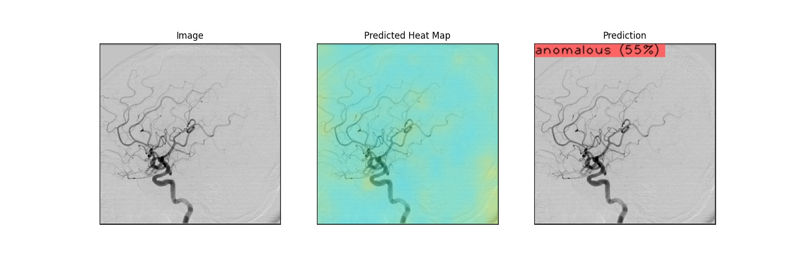

# k-ium 의료 인공지능 경진대회

**팀명 : AID**
|팀원 이름|github|
|---|---|
|박시형|[GithubLink](https://github.com/sihyeong671)|
|홍진욱|[GithubLink](https://github.com/JinukHong)|
|손봉국|[GithubLink](https://github.com/zespy5)|

---

## 개발 환경

> ### CPU
> - Intel(R) Core(TM) i7-10700F CPU @ 2.90GHz   2.90 GHz
> - 64비트 운영 체제, x64 기반 프로세서
> ### OS
> - Window11 Home
> ### GPU
> - NVIDIA GeForce RTX 3060
> ---
> ### 가상환경 
> - pyenv-win version 3.1.1
> - python 3.9.13
> - 자세한 라이브러리는 Pipfile, Pipfile.lock을 통해 확인 가능
> - CUDA version 11.7
> - CuDnn version 8.3

## 사용방법

```bash
# 파이썬 버전 3.9.13 설치(pyenv 권장)
# 3.9.13 환경 위에 pipenv 설치

# 폴더 구조
ckpt
 -- pth file
data
 -- trian_set
  -- images
  -- train.csv
main.py
...

git clone https://github.com/sihyeong671/k-ium-medical-AI-competition.git
cd k-ium-medical-AI-competition

pyenv local 3.9.13
pipenv install

pipenv shell
# 학습
# output pth이름은 trainer.py의 torch.save에서 이름 수정 필요
python main.py --mode=train
# 추론
# load_model funcion에서 사용할 모델이름 수정 필요
python main.py --mode=test
```

---

## 개요
저희는 부산대학교 인공지능 동아리에서 참여한 AID팀입니다. 두개내 동맥류는 다양한 질병을 유발할 수 있는 뇌혈관 장애입니다. 임상적으로 두개내 동맥류의 진단은 digital subtraction angiography(뇌혈관 조영술) 방식을 주로 사용합니다. 하지만 혈관조영술 이미지만으로 뇌동맥류를 찾는 것은 숙련된 의료지식이 필수적입니다. 이에 사람의 개입을 최소화하여 혈관조영술 이미지를 분석하고자 하는 시도가 계속되었고 기존의 영상진단지원(CAD) 연구는 고전적인 디지털 이미지 처리(DIP) 방법을 기반으로 했습니다. 그러나 고전적인 특징추출 방법은 복잡한 혈관 분포로 인해 정확도가 높지 않으며 슬라이딩 윈도우 방법은 검색 및 특징 추출 중에 시간이 많이 소요됩니다. 따라서 인공지능을 통해 혈관조영술 이미지에서 두개내 동맥류를 검출하기 위해 비전 딥러닝 모델 개발을 목표로 합니다.

저희 팀은 크게 4가지의 방법을 시도 하였습니다. 
1) anomalib을 이용한 anomaly detection
2) 각 type 별 classification + grad-cam
3) multilable classification
4) binary classification


저희가 문제해결을 위해 anomaly detection, Classification과 CAM을 통한 위치지정 분류, 그리고 multilabel classification을 시도해보았습니다.

아래는 anomalib의 PaDim 모델을 통해 얻은 결과입니다.




첫번째 이미지처럼 구조의 큰 변화는 잘 찾는 걸 볼 수 있습니다. 하지만 두번째 이미지처럼 혈관이 아닌 이미지를 구분하지 못하고, 세번째 이미지처럼 작은 뇌동맥류를 찾지 못했습니다. 결과를 본 후 뇌동맥류를 찾는데 anomaly detection을 이용하기 힘들다고 판단하였습니다.

Classification과 CAM을 통한 위치지정 분류는 classification을 통해 학습한 모델이 집중한 부분을 특징지어 보려했습니다.
<p align=center>

</p>
하지만 위 이미지처럼 모델이 특정한 위치의 부분이 혈관을 가르키지 못했습니다. 데이터의 특성상 값이 0인 비율이 커서 모델 학습이 정확하지 못하다고 판단하였습니다.

Multilabel classification 레이블을 이용하여 supervised learning을 실행하였습니다. 영상 type마다 보이는 부분이 달라 LI-A, LI-B, LV-A, LV-B, RI-A, RI-B, RV-A, RV-B 각각에 대해 모델을 만들었습니다. 레이블의 불균형으로 인해 weighted bceloss를 사용했고 각 모델에 대한 결과값을 종합해보았지만 대부분의 결과값이 0.5를 넘지 못하였고 AUROC score가 0.52정도에 그쳐 다른방법을 선택하기로 했습니다.

## 최종 모델 요약

최종적으로 저희팀은 AUROC 점수가 우선적으로 계산되기 때문에 위치보다 뇌동맥류 여부에 집중을 하기로 결정했습니다. 주어진 8장의 영상이미지를 합쳐 하나의 input으로 모델에 넣어서 최종적으로 뇌동맥류를 판단하도록 하는 모델로 구성했습니다.

모델은 Efficientnet b4를 선택했습니다. 모델의 깊이, 너비 및 해상도를 균형 있게 조정하여 정확성과 효율성을 높였고 B6 또는 B7과 같은 상위 버전보다 상대적으로 크기가 작으면서 결과값이 안정적으로 나와 해당 모델을 선정했습니다. 또한 timm 라이브러리의 사전학습된 모델을 사용했습니다.

```py
# model.py
class Effnetb4_v1(nn.Module):
  def __init__(self, num_features=1):
    super().__init__()
    self.model = timm.create_model("efficientnet_b4", pretrained=True)
    self.model.conv_stem = nn.Conv2d(8, 48, kernel_size=(3, 3), stride=(2, 2), padding=(1, 1), bias=False)
    self.model.classifier = nn.Linear(in_features=1792, out_features=num_features)
    
  def forward(self, x):
    x = self.model(x)
    return F.sigmoid(x)
```


### 학습 세부 사항

1. Augmentation
- ElasticTransform (alpha=100, sigma=10)
- GaussianBlur
- 256 x 256 resize
- 8장의 이미지 GraySacle 변환후 concatenation하여 input으로 사용
2. HyperParameter
- epoch: 20
- optimizer: Adam
- learning rate: 0.001
- batch_size: 32
3. train, validation 분할
- sklearn의 train_test_split을 사용하였으며 stratify 옵션에서 뇌동맥류 여부를 지정해 train, val의 데이터 분포가 동일하도록 지정
- test_size: 0.2

### 결과

**C-statistic(AUROC score):  0.906**
